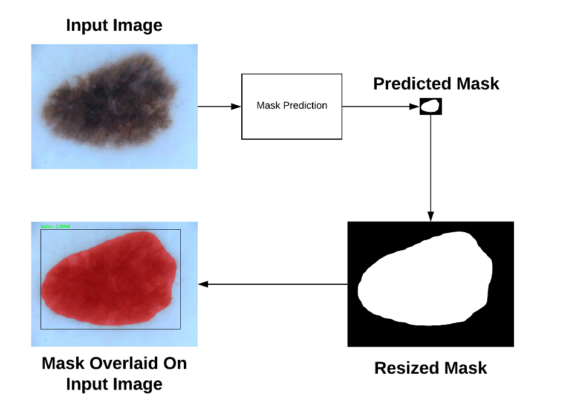

# Skin_lesion_analysis_for_melanoma_detection
This is a research project for using instance segmentation networks for cancer detection
## Overview
Skin cancer(Melanoma), the most common human malignancy, is primarily diagnosed visually, beginning with an initial clinical screening and followed potentially by dermoscopic analysis, a biopsy and histopathological examination. Melanoma is a major public health concern with over 5,000,000 newly diagnosed cases per year in the United States alone. Melanoma is also the deadliest form of skin cancer with 350,000 reported cases and 60,000 deaths in 2015. The good news is that when caught early, melanoma survival rates are in excess of 95%. Therefore, early detection of the cancer is key.

The goal of this project is to automatically segment the boundaries of potential cancerous regions from dermoscopic images. The goal is broken down into three tasks, the first task of this project is to correctly predict the pixel-wise masks from the input image. The second task is more challenging, involving automatically predicting and localizing various attributes of the lesion, such as pigment networks, streaks, milia-like cysts, and more. Finally image classification is performed, given an input image the goal is to classify the lesion into seven distinct categories such as Melanoma, Basal cell carcinoma, Melanocytic nevus and others.



Segmentation in this project is performed with the Mask R-CNN pre-trained on COCO model. The Mask R-CNN algorithm was introduced by Facebook AI Research in their 2017 [paper](https://arxiv.org/pdf/1703.06870.pdf), Mask R-CNN. Mask R-CNN builds on the previous object detection work of R-CNN, [Faster R-CNN](https://arxiv.org/pdf/1506.01497.pdf). Faster R-CNN is turned into a Mask R-CNN by adding an additional branch to the network. This additional branch is responsible for predicting the actual mask of an object class.


## Dependencies
This project has the following dependencies: 
```
Numpy
Scikit-learn 
Keras 
Tensorflow 
OpenCV
```


## Dataset used
International Skin Imaging Collaboration (ISIC) 2018 Skin Lesions dataset consisting of 2,594 images in JPEG format (11GB) and 2,594 corresponding ground-truth masks in PNG format (27MB).All masks are encoded as single-channel (grayscale) images. Each pixel in the mask has only one of two values 0: Areas outside the lesion, 255: Areas inside the lesion.


## Usage
###### To train the model
train Mask R-CNN on ISIC 2018 dataset
```
python lesions.py --mode train
```

###### To validate the model
```
python lesions.py --mode investigate
```
###### To predict from the model
When Mask R-CNN is trained, predictions are done with
```
python lesions.py --mode predict \
--image isic2018/ISIC2018_Task1-2_Training_Input/ISIC_0000000.jpg
```
## Credits
```

```
